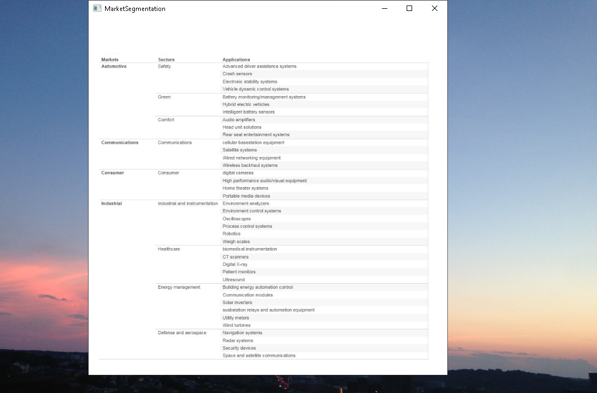

# TechnicalProductManagement

The project provides an overview of the basic elements of product marketing and planning . For details, please click on the executable located in 
https://github.com/alpaddesai/TechnicalProductManagement/releases. Company confidential information is not displayed. 
All images are either custom by Alpa D Desai or a reference name is included. Most of the images are custom. Copyright protection in process.

## Basic Elements

## Project Management

## Business Requirements Document
 

## Company Product Distribution Map

## Strategic Goals

## Market Segmentation

## Application Segmentation

## User Requirements

## Business Case Analysis

## Testing 

